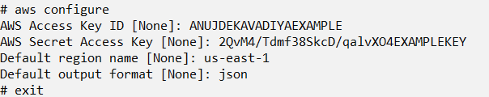
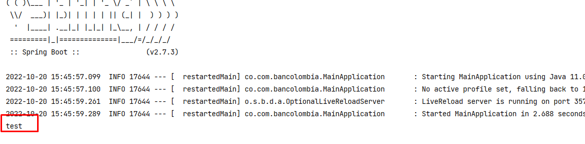

# Proyecto Base Listener SQS y Localstack Implementando Clean Architecture

## Antes de Iniciar

Lo primero que debemos hacer es levantar la imagen docker de localstack para poder crear la cola sqs y enviar mensajes a
ella, para esto debemos ejecutar el comando `docker-compose up -d` en una terminal bash desde la raíz del directorio. En
la raíz del directorio existe el archivo `docker-compose.yml`

Al ejecutar el comando veremos algo como esto:

Posterior a levantar el comando vamos a ingresar a la imagen docker de localstack, para ello ejecutaremos:
`docker exec -it localstack sh`

Posterior debemos configurar el cliente aws, donde ejecutaremos:
`aws configure`

LLenaremos los datos que se solicitan a continuación:

Importante: AWS Access Key ID y AWS Secret Access Key pueden ser cualquier valor

Despues de esto ya nos podemos salir de la imagen docker, escribiendo `exit` en la consola

Luego de seguir los pasos anteriores debemos crear la cola SQS que vamos a escuchar, para ello en la consola ejecutaremos:
 
`aws --endpoint http://localhost:4566 sqs create-queue --queue-name sample-queue`

Esto nos creara la cola y nos dará la siguiente información:  
`{ "QueueUrl": "http://localhost:4566/000000000000/sample-queue" }`

Esta url la debemos configurar en el `application.yaml` en el modulo de `application/app-service`

## Ejecutar Aplicativo
Posterior a la configuración debemos ejecutar la aplicación por medio del IDE. Para probar el aplicativo enviaremos un 
mensaje a la cola y imprimiremos este mensaje por consola
 
Para enviar un mensaje a la cola de SQS ejecutaremos el siguiente comando:
 
`aws --endpoint http://localhost:4566 sqs send-message --queue-url http://localhost:4566/000000000000/sample-queue --message-body test`

Con el mensaje enviado y el listener activo por la consola de ejecución deberíamos ver:
